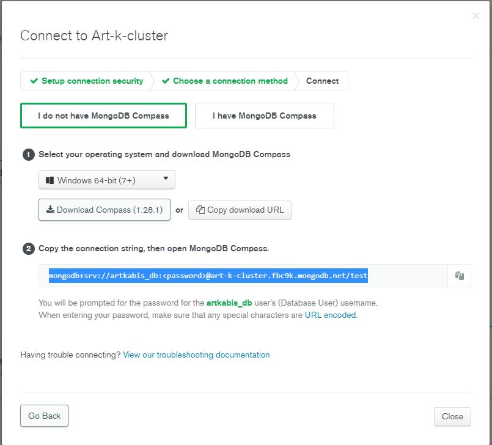
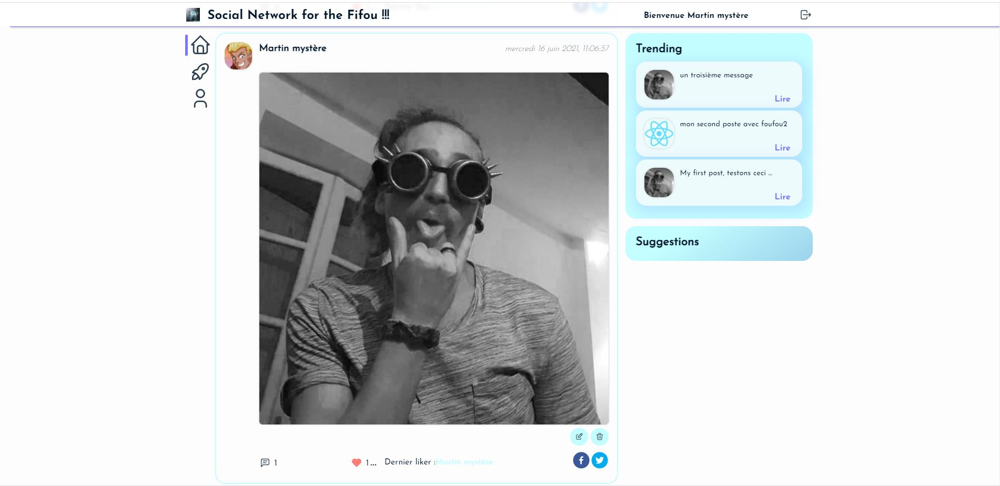

# 🚀 Javascript full-stack 🚀
## MERN Stack
### React / Express / MongoDB / Redux

Start server : `npm start`
Start client : `cd client` + `npm start`

_____________________________

### Back config :

* Put your cluster info inside `/config/db.js`
* Create `.env` file inside `/config/` within the following data
  - PORT=5000 `your localhost port`
  - CLIENT_URL=http://localhost:3000 `your client url`
  - DB_USER_PASS=artkabis_db:monmotdepass `your ID & password`
  - TOKEN_SECRET=4f56ds454f545f454f545f4d5 `your random secret key`[ Generate web token to jwt.io ](https://jwt.io/)
  
  * Mongodb Atlas `url to database` 
_________________________
  
### Front config : 
* Create a `.env` file within the server URL :
  - CHOKIDAR_USEPOLLING=TRUE
  - REACT_APP_API_URL=http://localhost:5000/ `server url`
    
_____________________________

  
💻 Made by Julien Az, November 2020. Free to use 
💻 Custom project to Artkabis, Jun 2021.
